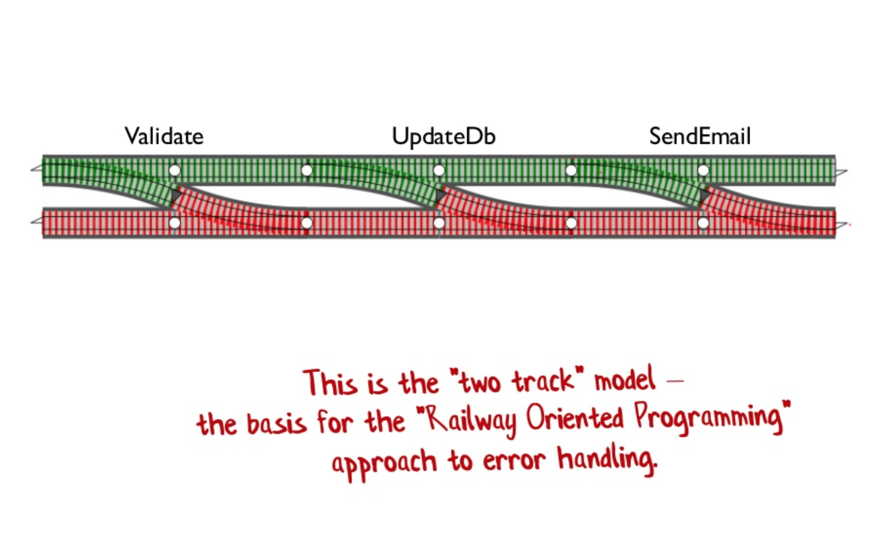
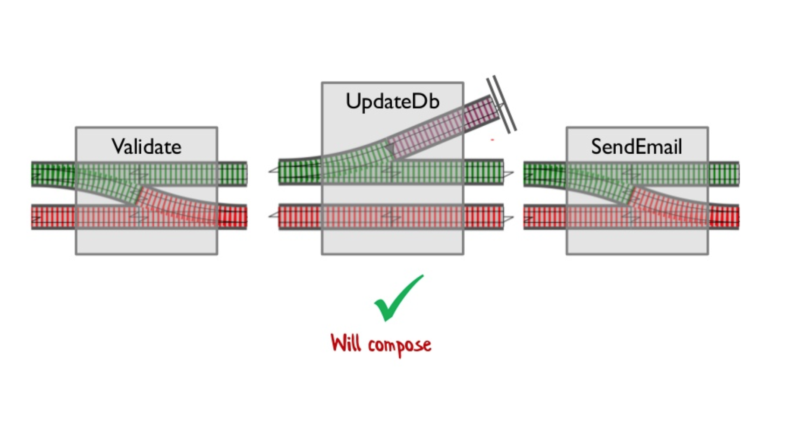

footer: Reactive Programming  Workshop, by Paul Taykalo, #CocoaHeadsUkraine#13
slidenumbers: true

#Reactive Programming Workshop
### by Paul Taykalo, Stanfy

 ---

#Plan

 ---
# Plan
- About Reactive Programming
- Basics
- Reactive Libraries Differences
- Debugging Tooltips
- Modifying Code to Reactive 
- Switching Back from Reactive?

---

# About Reactive Programming

---

# Async vs Sync

---

# Everything is a Stream

---


# Stream of values over time

---

# Stream
- Push driven
- Can send multiple values
- Can be cancelled
- Can complete
- Can fail with error
- _Can be termintated_ (Ugh) *

---

#Stream
#Observable
#Signal
#SignalProducer

---

#[fit]Signal<Value, Error>

---

#[fit]Signal<__*Value*__, Error>

---

#[fit]Signal\<Value,__*Error*__>

---
#[fit]Signal<__*Event*__>

---
# Signal Events
```swift 
enum Event<Value, Error> {
    case value(Value)
    case failed(Error) 
    case completed     
    case interrupted
}
```
---
# Signal Termination
```swift 
enum Event<Value, Error> {
    case value(Value)
    case failed(Error) //❌
    case completed     //❌
    case interrupted   //❌
}
```
---

#[fit]Signal
#[fit]SignalProducer
---

#[fit]Signal🔥
#[fit]SignalProducer⛄
---

# Signal Producer vs Signal
```swift
let tvSignal: Signal<EMChange,NoError>

struct TV {
  let signal: Signal<EMChange,NoError>
  let channels: [SignalProducer<Frame, Error>]
}
```
---
#[fit]Transformations
---
#[fit]map
#[fit]Signal<__*V*__,E> -> Signal<__*V'*__,E>
---
###map
```swift
let ints: Signal<Int, NoError>
let strings = ints.map { int in "\(int)"}
// string: Signal<String, NoError>
```
---
#[fit]mapError
#[fit]Signal\<V,__*E*__> -> Signal\<V,__*E'*__>
---
###mapError
```swift
let ints: Signal<Int, NoError>
let failableInts = ints.mapError { err in 
  CustomError.failed
}
// string: Signal<Int, CustomError>
```
---
#[fit]flatMap
#[fit]Signal\<__*V*__,__*E*__> -> Signal\<__*V'*__,__*E'*__>
---
###flatMap
```swift
let strings: Signal<String, NoError>
let ints = ints
  .flatMap(.latest) { string in 
    guard let int = Int(string) else {
      return .init(error: CustomError.parsingFailed)
    }
    return .init(value: int)
  }
// ints: Signal<Int, CustomError>
```
---
###flatMap
```swift, [.highlight: 3]
let strings: Signal<String, NoError>
let ints = ints
  .flatMap(.latest) { string in 
    guard let int = Int(string) else {
      return .init(error: CustomError.parsingFailed)
    }
    return .init(value: int)
  }
// ints: Signal<Int, CustomError>
```
---

###flatMap
```swift, [.highlight: 5]
let strings: Signal<String, NoError>
let ints = ints
  .flatMap(.latest) { string in 
    guard let int = Int(string) else {
      return .init(error: CustomError.parsingFailed)
    }
    return .init(value: int)
  }
// ints: Signal<Int, CustomError>
```
---

###flatMap
```swift, [.highlight: 7]
let strings: Signal<String, NoError>
let ints = ints
  .flatMap(.latest) { string in 
    guard let int = Int(string) else {
      return .init(error: CustomError.parsingFailed)
    }
    return .init(value: int)
  }
// ints: Signal<Int, CustomError>
```
---

###flatMap
```swift
let getUserID: SignalProducer<User, NetworkError>
let userIDs: SignalProducer<String, NoError>
let users = userIDs
  .producer
  .flatMap(.latest) { userID in 
    getUserID(userID) 
  }
// users: SignalProducer<User, NetworkError>
```
---

###flatMap
```swift, [.highlight: 4]
let userIDs: Signal<String, NoError>
let getUserID: SignalProducer<User, NetworkError>
let users = userIDs
  .producer  // Signal to SignalProducer
  .flatMap(.latest) { userID in 
    getUserID(userID) 
  }
// users: SignalProducer<User, NetworkError>
```
---

###flatMap
```swift, [.highlight: 5-7]
let userIDs: Signal<String, NoError>
let getUserID: SignalProducer<User, NetworkError>
let users = userIDs
  .producer  // Signal to SignalProducer
  .flatMap(.latest) { userID in 
    getUserID(userID) 
  }
// users: SignalProducer<User, NetworkError>
```
---
#[fit]Combinations
---

#merge
#[fit]combineLatest
#zip
#collect

---

#Other

---

#Let's go & Code

---

# Workshop time
Simple Signals & Merging

---

#Workshop time
Values and Errors

---
#Workshop time
Chaining and Compiler

---

# Reactive Rocks?
---

#Railway oriented Programming



---
#Railway oriented Programming


---
# SideEffects


---

# Errors Layering

---
#[fit] Domain Objects

---

#[fit] Domain Objects
#[fit] Domain Errors

---
```swift
class API {
 enum Error: Swift.Error {
   case unauthorized
   case error(NSError)
 }
 func getUser() -> SignalProducer<JSON, Error>  
}

```
---
```swift, [.highlight: 2-5]
class API {
 enum Error: Swift.Error {
   case unauthorized
   case error(NSError)
 }
 func getUser() -> SignalProducer<JSON, Error>  
}

```
---

```swift
class UserModel {
  enum Error: Swift.Error {
    case fetchFailed
    case validationFailed
  }
  func getUser() -> SignalProducer<User, Error> {
    return api.getUser
          .mapError { e in .fetchFailed }
          .flatMap(.latest, validate)
   
  }
}

```

---

```swift, [.highlight: 2-5]
class UserModel {
  enum Error: Swift.Error {
    case fetchFailed
    case validationFailed
  }
  func getUser() -> SignalProducer<User, Error> {
    return api.getUser
          .mapError { e in .fetchFailed }
          .flatMap(.latest, validate)
   
  }
}

```
---
```swift, [.highlight: 8]
class UserModel {
  enum Error: Swift.Error {
    case fetchFailed
    case validationFailed
  }
  func getUser() -> SignalProducer<User, Error> {
    return api.getUser
          .mapError { e in .fetchFailed }
          .flatMap(.latest, validate)
   
  }
}

```
---
```swift, [.highlight: 9]
class UserModel {
  enum Error: Swift.Error {
    case fetchFailed
    case validationFailed
  }
  func getUser() -> SignalProducer<User, Error> {
    return api.getUser
          .mapError { e in .fetchFailed }
          .flatMap(.latest, validate)
   
  }
}

```
---

#[fit]Example

---
#[fit]Login ->
#[fit]Get User Info ->
#[fit]Get User Profile ->
#[fit]Allow User to Login ->

---

#[fit]Flow
---

#[fit]We need Reactive API!
---

```swift
public func reactive<Value>\(
    call: @escaping (
      @escaping(Value) -> (),
      @escaping (NSError) -> ()
    ) -> ()
) -> SignalProducer<Value, Error> {
    return SignalProducer.init { o, l in
        call(
            { o.send(value: $0); o.sendCompleted()},
            { o.send(error: .error($0))
        })
    }
}
```
---
```swift
func getUser() -> SignalProducer<User, Error> {
  return reactive(call: Network.getUser)
}
```


---


---

# Thank you


---

#Reactive Programming Workshop
### by Paul Taykalo, Stanfy
##@TT_Kilew

---

# The end

---


#Links

https://gist.github.com/JaviLorbada/4a7bd6129275ebefd5a6
https://fsharpforfunandprofit.com/rop/

---

# More links

